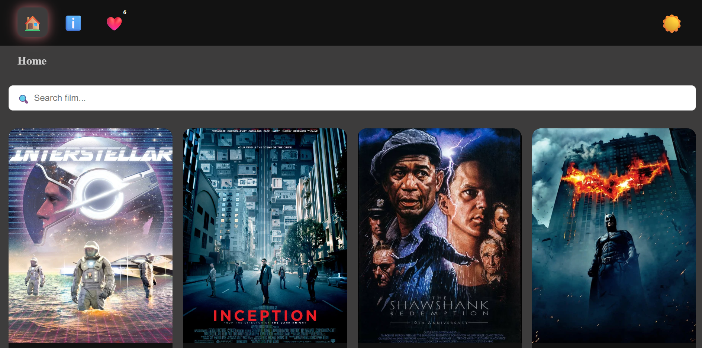
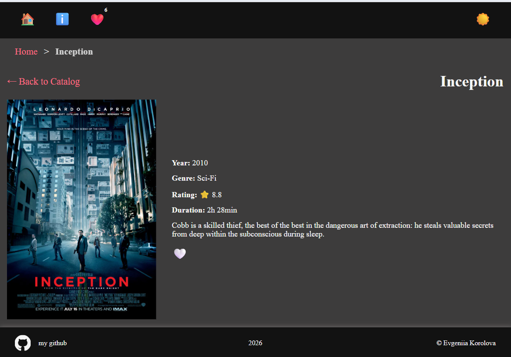
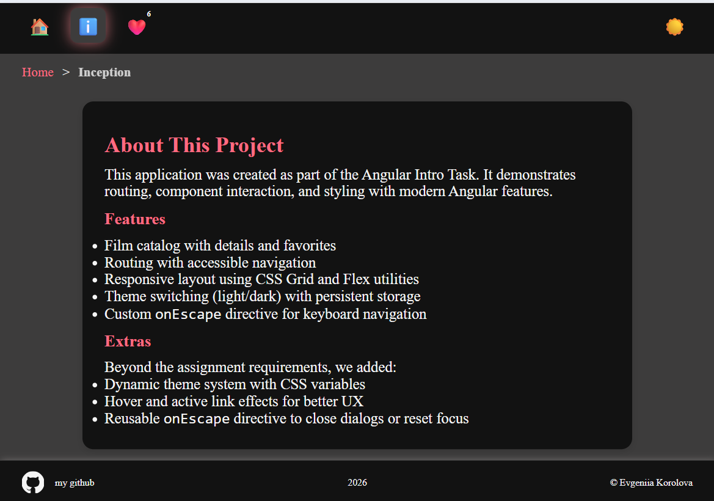

# FilmsCollection

This project was generated using [Angular CLI](https://github.com/angular/angular-cli) version 21.2.8.


## Overview
This project was created as part of the Angular Intro Task in RSScool. It demonstrates routing, component interaction, and styling with modern Angular features.

## Features
- Film catalog with details and favorites
- Routing with accessible navigation
- Responsive layout using CSS Grid and Flex utilities
- Theme switching (light/dark) with persistent storage
- Custom `onEscape` directive for keyboard navigation

## Tech Stack
- Angular 21
- angular-eslint 21.3.1
- eslint ^10.0.3
- eslint-plugin-unicorn ^64.0.0
- Deploy: angular-cli-ghpages ^3.0.3

## Deployment
Deployed with angular-cli-ghpages.  
[Live Demo](https://evgeniia-korolova.github.io/films-collection/)

## Screenshots




## Extras
- Dynamic theme system with CSS variables
- Hover and active link effects for better UX
- Reusable `onEscape` directive

## License
MIT

## Development server

To start a local development server, run:

```bash
ng serve
```

Once the server is running, open your browser and navigate to `http://localhost:4200/`. The application will automatically reload whenever you modify any of the source files.


## Building

To build the project run:

```bash
ng build
```

This will compile your project and store the build artifacts in the `dist/` directory. By default, the production build optimizes your application for performance and speed.

